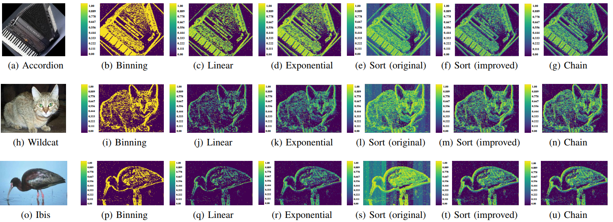

# Chain Normalization
#### Efficient Spatial-Temporal Normalization in Surface of Active Events

**Prerequisite**
1. Install the following packages
```
sudo apt-get install cmake gcc g++ libeigen3-dev
```
2. Install the [OpenCV](https://docs.opencv.org/3.4.6/d7/d9f/tutorial_linux_install.html) 


**How to build?**
```
git clone https://github.com/eleboss/chain.git
cd ./chain
mkdir build
cd ./build
cmake ../
make
```
**How to use?**
1. Download the txt files of event data from [DAVIS240C Dataset](http://rpg.ifi.uzh.ch/davis_data.html).
2. Unzip it.
3. Find the file **event.txt**, and change the file path in c++ code to it.
4. Repeat the build process.
5. Use the following to run
```
./csae
./stackchain
```
BTW, you can use the python scripts for visualization.

**Prerequisite**
```
pip install mayavi
```
Run the normalization code  
Then
```
cd ./scripts
python mayavi_matc.py
```

<!-- #### Results -->
<!--  -->

<!-- #### Animation -->

@ARTICLE{9095269,
  author={S. {Lin} and F. {Xu} and X. {Wang} and W. {Yang} and L. {Yu}},
  journal={IEEE Robotics and Automation Letters}, 
  title={Efficient Spatial-Temporal Normalization of SAE Representation for Event Camera}, 
  year={2020},
  volume={5},
  number={3},
  pages={4265-4272},
  doi={10.1109/LRA.2020.2995332}}
